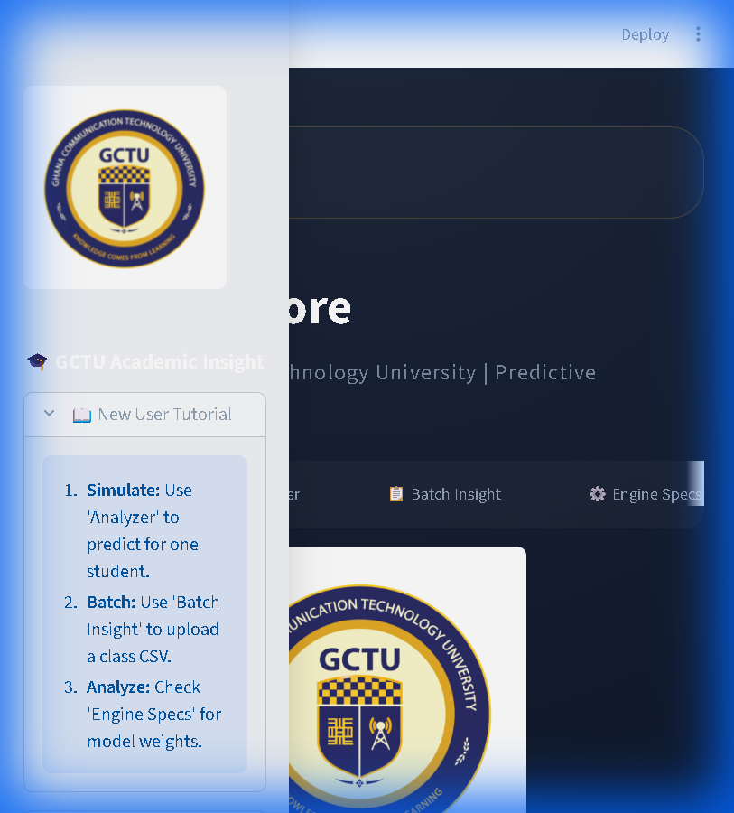
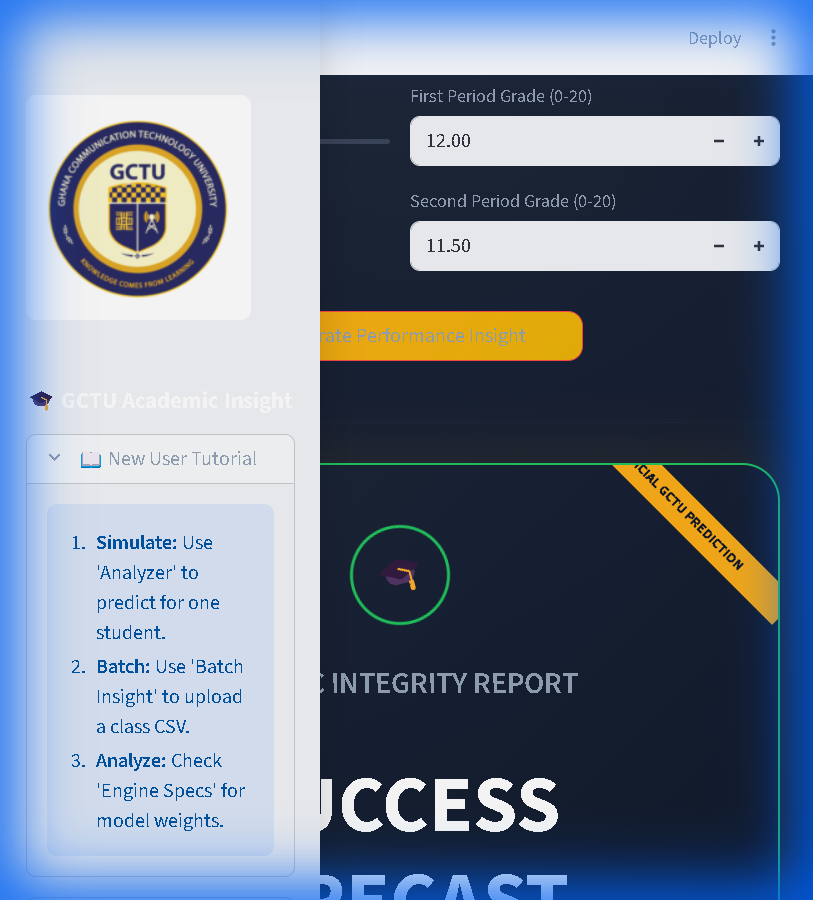

# 🎓 Predictive Core: Academic Performance Insight Engine

[](https://www.python.org/)
[](https://streamlit.io/)
[](https://scikit-learn.org/)
[](https://opensource.org/licenses/MIT)

<p align="center">
  
</p>

## 🌟 Overview

**Predictive Core** is a high-fidelity predictive analytics platform designed to anticipate student academic outcomes. Built for the **Ghana Communication Technology University (GCTU)**, this engine transforms behavioral markers—such as study habits, attendance, and historical performance—into precise, actionable intelligence.

---

## 📸 visual Tour

### 🏠 Command Center (Home)
The central hub providing an overview of the system's capabilities and integrated tutorials for new users.


### 🎯 Neural Analyzer
Individual student simulations with real-time probability confidence and automated academic integrity reports.


### 📋 Cohort Intelligence (Batch Insight)
Process entire class datasets instantly to segment populations into success and risk categories.


---

## 🧠 Intelligence Architecture

### The Algorithm: Random Forest Ensemble
Predictive Core is powered by a **Random Forest (RF) Classifier**, one of the most robust and accurate algorithms in modern Machine Learning for tabular data.

#### How it Works:
1.  **Ensemble Learning**: Unlike a single decision tree which can be biased, Random Forest builds **100 individual decision trees** (estimators).
2.  **Bagging (Bootstrap Aggregating)**: Each tree is trained on a random subset of the data and a random selection of features.
3.  **Consensus Voting**: When a prediction is requested, all 100 trees "vote" on the outcome. The final result is the majority consensus.
4.  **Local Factor Analysis**: Predictive Core uses the model's internal **Feature Importance** to explain *why* a specific student is at risk.

---

## 🖥️ Local Development Guide (VS Code)

### 1. Prerequisites
*   **VS Code**: [Download here](https://code.visualstudio.com/)
*   **Python 3.10+**: [Download here](https://www.python.org/)

### 2. Setup Procedure
```bash
# Clone the Repository
git clone https://github.com/BRIGHTEDUFUL/predictive-core-.git
cd predictive-core-

# Create \u0026 Activate Virtual Environment
python -m venv venv
.\venv\Scripts\Activate.ps1

# Install Dependencies
pip install -r requirements.txt
```

### 3. Running the Application
```bash
streamlit run app.py
```

---

## 📡 Predictive Vectors (Model Inputs)

| Vector | Description |
| :--- | :--- |
| **Study Habits** | Average hours of focused daily study (1-5 hrs). |
| **Academic History** | Count of previous failed course attempts (0-4). |
| **Attendance** | Total absences recorded during the academic cycle. |
| **G1 \u0026 G2 Grades** | Performance scores from the first and second assessment periods. |

---

<p align="center">
  Made with ❤️ by the <b>GCTU AI Research Team</b>
</p>